# OIDC & Permissions System - Flow Diagrams

This document provides visual representations of the authentication and permissions flow.

## Authentication Flow

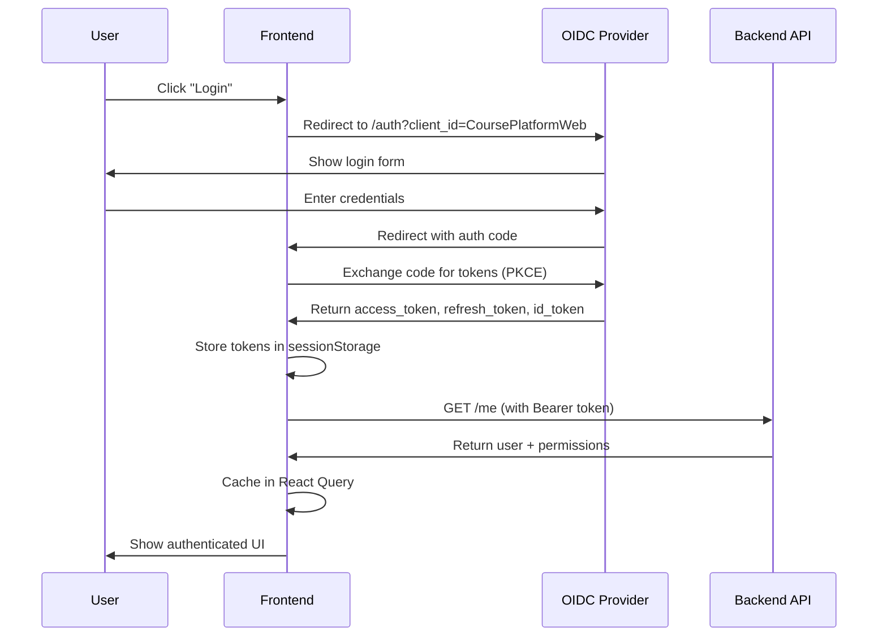

## Permission Check Flow

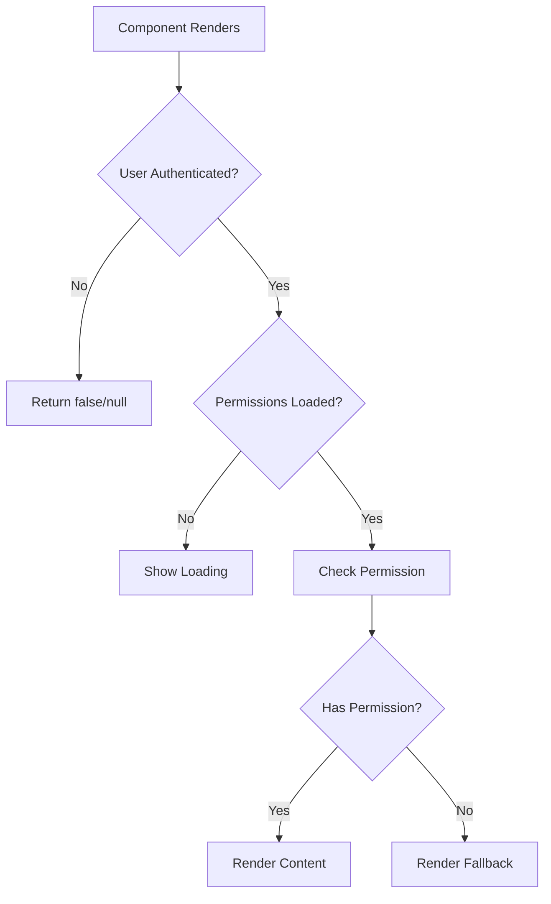

## 401 Error Handling Flow

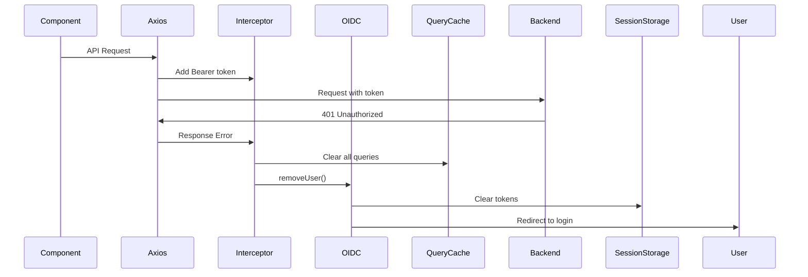

## Component Hierarchy

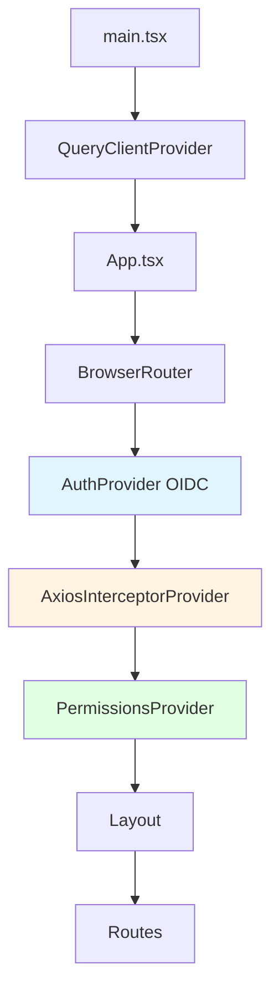

## Data Flow

```mermaid
flowchart LR
    A[OIDC Login] --> B[Access Token]
    B --> C[Axios Interceptor]
    C --> D[API Request]
    D --> E[/me Endpoint]
    E --> F[User + Permissions]
    F --> G[React Query Cache]
    G --> H[PermissionsContext]
    H --> I[Permission Hooks]
    I --> J[Components]
    
    style A fill:#ffebee
    style E fill:#e3f2fd
    style G fill:#f3e5f5
    style I fill:#e8f5e9
```

## Permission Checking Logic

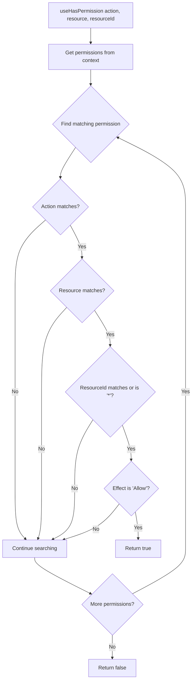

## State Management

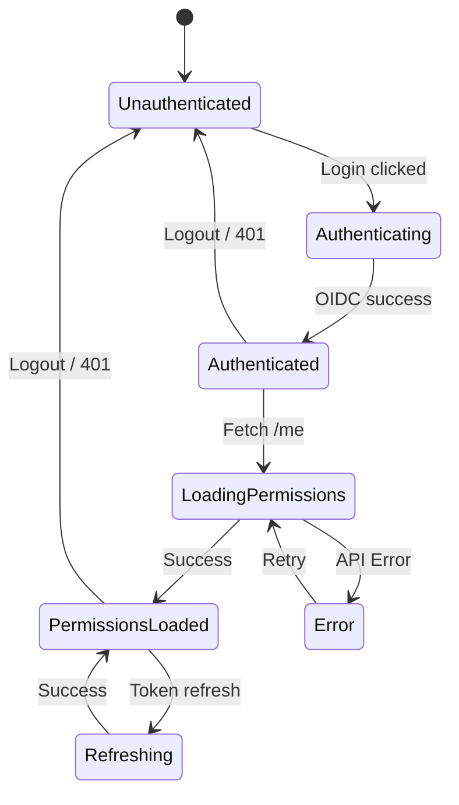

## Token Lifecycle

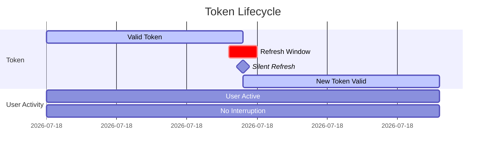

## Error Handling

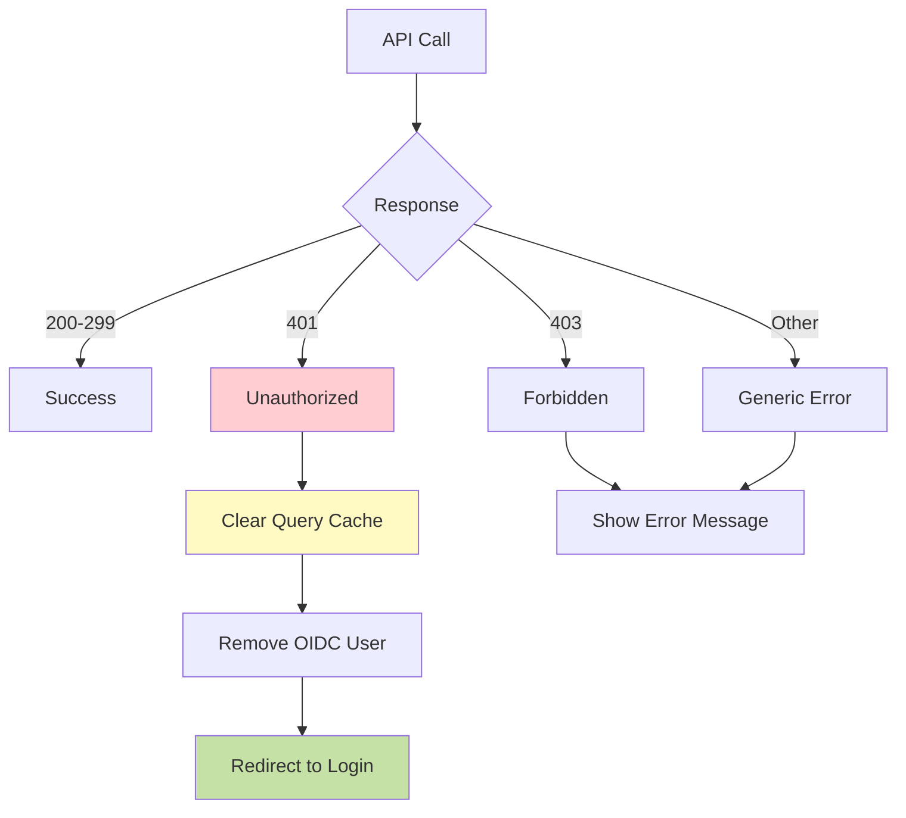

## Permission Guard Component Flow

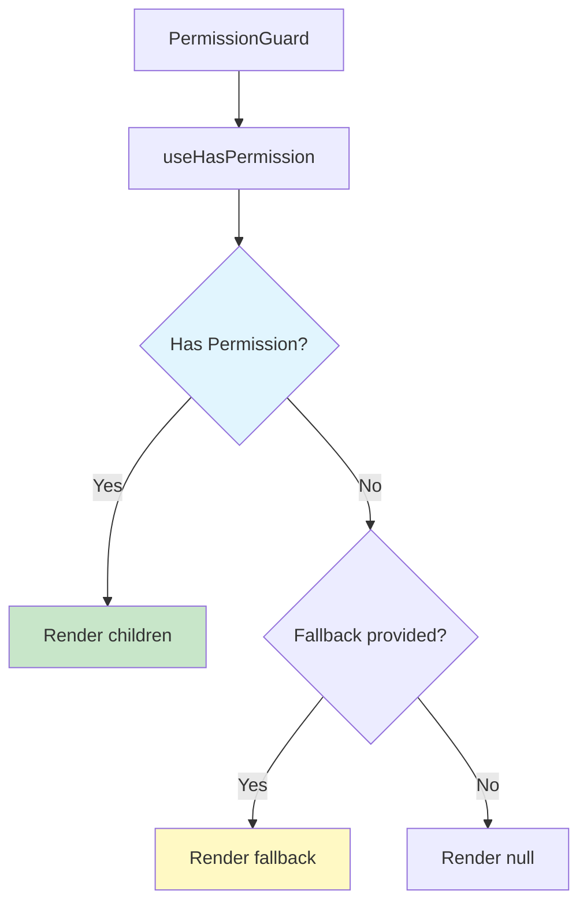

## System Integration Overview

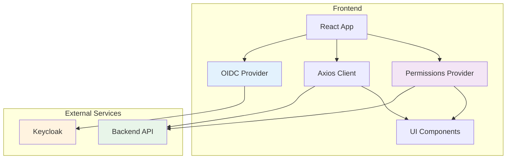

## Cache Strategy

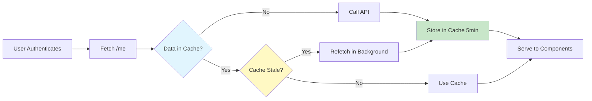

## Usage Patterns

### Pattern 1: Hook-based Permission Check
```typescript
const canEdit = useHasPermission("Update", "Course", courseId);
if (canEdit) {
  // Show edit button
}
```

### Pattern 2: Guard Component
```typescript
<PermissionGuard action="Delete" resource="User">
  <DeleteButton />
</PermissionGuard>
```

### Pattern 3: Multiple Permissions
```typescript
const hasAny = useHasAnyPermission([
  ["Create", "Course"],
  ["Update", "Course"]
]);
```

### Pattern 4: Role-based
```typescript
const isAdmin = useHasRole("Admin");
```

---

## Performance Considerations

- **Caching**: Permissions cached for 5 minutes
- **Memory**: In-memory permission checks (fast)
- **Network**: Single `/me` call per session
- **Refresh**: Silent token refresh (no UI interruption)

## Security Features

- ✅ PKCE flow (prevents code interception)
- ✅ Short-lived access tokens
- ✅ Automatic token rotation
- ✅ Secure session storage
- ✅ 401 auto-logout
- ✅ No token logging
